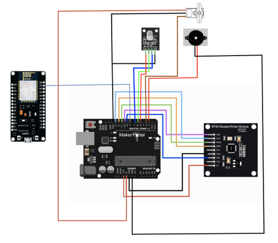

# Pill Dispenser Project

This project is a pill dispenser designed to help manage medication intake. It uses an Arduino-based setup with various components to automate the process of dispensing pills based on RFID identification. The dispenser ensures that only authorized users can access the pills, and it provides visual and audible feedback for the user.

## Components Used
- **Arduino**: The main microcontroller that manages the entire system.
- **ESP8266**: For potential future connectivity or remote monitoring.
- **RFID RC522**: To identify the user via RFID tags.
- **Servo**: To control the dispensing mechanism of the pills.
- **Buzzer**: To give audible feedback to the user.
- **RGB LED**: To provide visual feedback, indicating the system status (e.g., ready, error, etc.).

## Wiring Diagram

  

